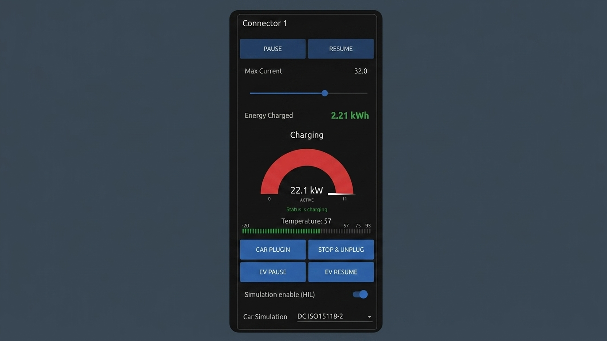

# ISO 15118-20

## Overview

ISO 15118-20 is the successor to ISO 15118-2, published in 2022. It introduces bidirectional power transfer (V2G), wireless charging, and a more flexible service model. In EVerest, it is implemented by the `Evse15118D20` module using Josev.

State machine location:
`everest-core/build/dist/libexec/everest/3rd_party/josev/iso15118/secc/states/iso15118_20_states.py`

## Key Differences from ISO 15118-2

| Feature | ISO 15118-2 | ISO 15118-20 |
|---------|-------------|--------------|
| Bidirectional (V2G) | No (hack only) | Yes — DC_BPT service |
| Authorization | Implicit | Explicit AuthorizationSetup state |
| Services | Fixed | Extensible service discovery |
| Smart charging | Basic | ScheduleExchange with Dynamic mode |
| Charging loop | CurrentDemand | DCChargeLoop / ACChargeLoop |
| Wireless charging | No | Yes (WPT) |

## Full DC Charging Sequence
```
SDP (IPv6 UDP multicast)
        |
SupportedAppProtocol
        |
SessionSetup
        |
AuthorizationSetup      ← new in ISO 15118-20
        |
Authorization
        |
ServiceDiscovery        ← new in ISO 15118-20
        |
ServiceDetail           ← new in ISO 15118-20
        |
ServiceSelection        ← new in ISO 15118-20
        |
DCChargeParameterDiscovery
        |
ScheduleExchange        ← new in ISO 15118-20 — core of V2G
        |
DCCableCheck
        |
DCPreCharge
        |
PowerDelivery (Start)
        |
DCChargeLoop  ←── main charging loop
        |
PowerDelivery (Stop)
        |
DCWeldingDetection
        |
SessionStop
```

## New States Explained

### AuthorizationSetup
Explicitly negotiates the authorization method before proceeding:
- **EIM** (External Identification Means) — RFID card
- **PnC** (Plug & Charge) — certificate-based, no card needed

In ISO 15118-2 this was implicit. ISO 15118-20 makes it a dedicated state.

### ServiceDiscovery / ServiceDetail / ServiceSelection
ISO 15118-20 uses an extensible service model. The charger advertises available services and the EV selects what it wants:

- `DC` — standard DC charging
- `DC_BPT` — DC Bidirectional Power Transfer (V2G)
- `AC` — AC charging
- `Internet` — network access for the EV
- `Parking` — parking payment

The EV queries details about each service before selecting.

### ScheduleExchange — Core of V2G

The most important new state. Two control modes:

**SCHEDULED mode:**
The charger proposes a fixed list of charge/discharge schedules with times and power levels. The EV picks one and follows it. Predictable but inflexible.

**DYNAMIC mode:**
No fixed schedule. The charger sends real-time grid signals and the EV responds cycle by cycle. The vehicle acts as a grid asset — charging when energy is cheap, discharging when demand is high.

This is true V2G: the EV battery becomes a distributed energy resource on the grid.

Seen in EVerest logs:
Selected DC service parameters: control mode: Dynamic, mobility needs mode: ProvidedByEvcc

### DCChargeLoop
Replaces `CurrentDemand` from ISO 15118-2. The name is more explicit — it is a loop. In `DC_BPT` mode with Dynamic control, the EV can both charge and discharge within the same loop, cycle by cycle, responding to grid signals.

## Verified Results

Full ISO 15118-20 DC session completed on Ubuntu 24.04 native with EVerest:

SDP ✓ fe80:: link-local address on wlo1
SAP ✓ ISO 15118-20 DC negotiated (priority 1)
SessionSetup ✓ EVCC ID: WMIV1234567890ABCDEX
AuthSetup ✓ EIM selected
Authorization ✓ accepted
ServiceDiscovery ✓
ServiceDetail ✓ ServiceID 6 and 2
ServiceSelection ✓ DC, Dynamic mode
DCChargeParameterDiscovery ✓ 300A / 900V / 150kW
ScheduleExchange ✓ Dynamic mode agreed
DCCableCheck ✓ isolation verified at 900V
DCChargeLoop ✓ 22.1 kW active

